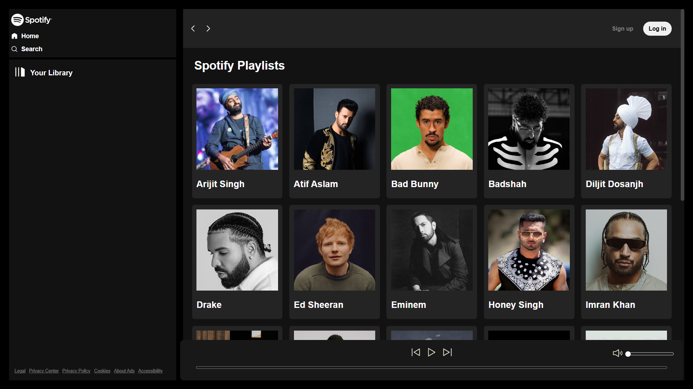
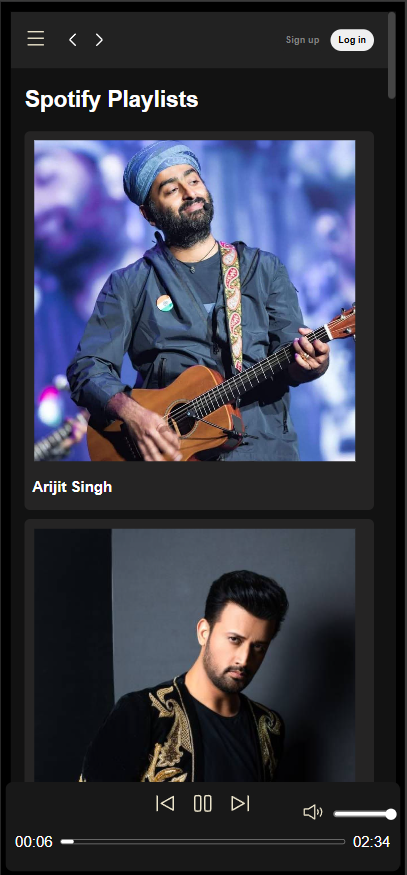
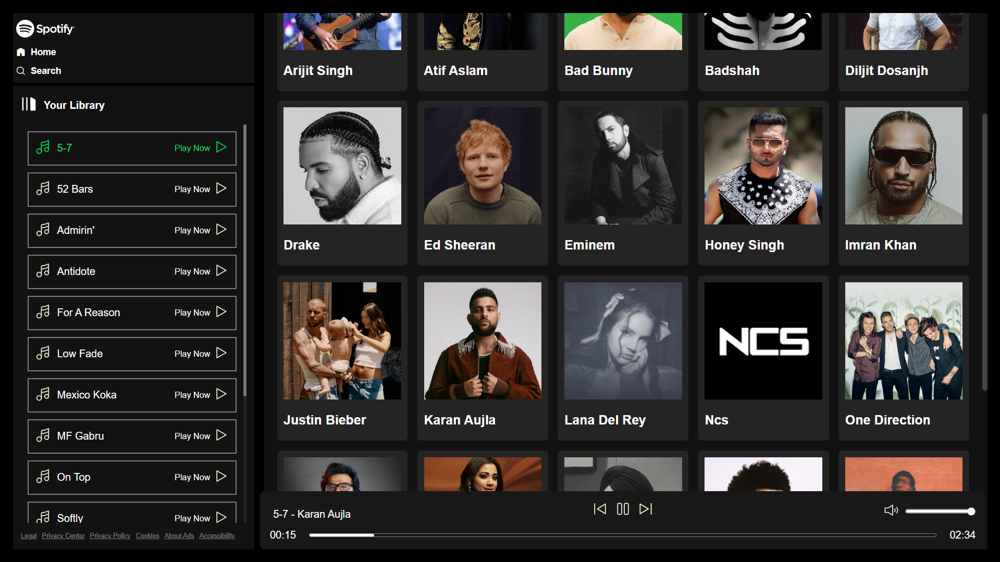

# Spotify Clone

A responsive Spotify-inspired music player web application built using HTML, CSS and JavaScript.

## Features

- 🎵 Browse music by artists
- ▶️ Play and pause songs
- ⏭️ Next and previous song controls
- 🔊 Volume control and mute/unmute
- 📊 Interactive song progress bar
- ⏱️ Current song duration and total duration
- 📱 Responsive design for different screen sizes
- 🍔 Mobile navigation menu
- 🎨 Spotify-inspired dark UI
- 🔄 Automatically plays the next track

## Technologies Used

- HTML5
- CSS3
- JavaScript
- HTML5 Audio API
- Fetch API

## Project Structure

```text
spotify-clone/
│
├── images/
├── screenshots/
├── songs/              # Local music files (not included in GitHub)
├── index.html
├── script.js
├── style.css
├── utility.css
├── favicon.ico
└── .gitignore

```

## Screenshots

### Home Page


### Mobile View


### Music Player


## Disclaimer

This project is created for educational and portfolio purposes only.

It is a Spotify-inspired frontend project and is not affiliated with, endorsed by, or connected to Spotify.

No copyrighted music files are included in this repository.

## Author

### Sommay Paliwal

GitHub: [@sommaypaliwal](https://github.com/sommaypaliwal)
